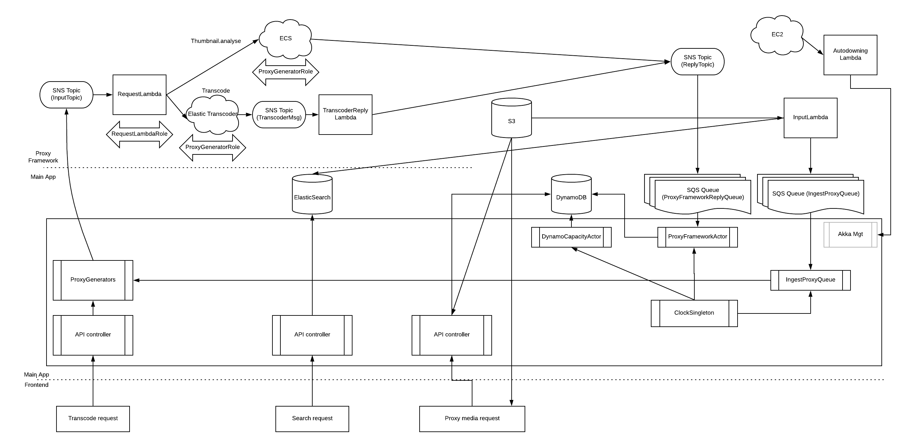

# ArchiveHunter proxy framework

## What is it?

This is a system that marshals content through Elastic Transcoder and
ECS (Elastic Container Service) in order to perform transcoding and media
analysis tasks for Archive Hunter (https://github.com/guardian/archivehunter).

It's completely stateless, relying only on lambda functions and queues.

It is intended that one instance of the proxy framework is deployed in each
region within which you have media buckets, because it's pointless moving large
media files between regions just to analyse them.

A single proxy framework deployment should serve a single Archive Hunter
deployment, but you can have as many proxy framework deployments associated
with a given Archive Hunter deployment.

## NOTE ON COSTS

The day-to-day running costs of the proxy framework are low because it's entirely based
on queues, topics and lambda functions; but the Elastic Transcoder service is Not Cheap.

The default configuration has the system automatically proxy every file that
is detected in an S3 bucket.
Therefore, all you need to do is to (a) configure the Proxy Framework, 
(b) ensure that proxying is switched on for your Scan Target in ArchiveHunter
and (c) start uploading content to your media bucket.

If you upload a _lot_ of media, then this can get very expensive very quickly.
I strongly recommend that before embarking on a large ingest you familiarise yourself
with the costs associated with Elastic Transcoder and make cost estimates of how
long it might take and how much money it will cost you before starting the process.

You can simply switch off proxying for each Scan Target configuration of ArchiveHunter
to avoid new media always getting sent out to proxy.  This will also prevent the user
from being able to manually proxy in the UI and can be easily changed at any time.

I can't be held responsible for any of your AWS bills!

## How does it work?


This diagram shows a schematic of the whole ArchiveHunter system.  The Proxy Framework
is at the top, the main webapp in the middle and the frontend at the bottom.

1. Either:
   - (a) Media is uploaded to S3 (the cylinder just above center of the diagram).
      It's picked up by ArchiveHunter's InputLambda, which registers the content to ElasticSearch
        and pushes an SQS message to the main app
   - (b) A bucket re-transcode is requested in ArchiveHunter admin
   - (c) The user manually requests a transcode of a given piece of media via the UI

2. The main app checks if a proxy already exists or if proxying is disabled. It then checks for
a Proxy Framework deployment in the region of the incoming bucket.  If one is found
   then it pushes a message onto the SNS InputTopic.
3. This is picked up by ProxyRequestLambda which decides what to do with it;
whether to send to Elastic Transcoder or to trigger an ECS container.
4. If we are sending requests to fast to either ECS or ETS (this can easily happen when you
   are uploading thousands of media files to S3) then the message is dropped to a "flood queue"
   where it is kept and then re-queued by the timed SweeperLambda
5. Elastic Transcoder is set up to push a message to SNS when the job completes, whether on
success or failure.  TranscoderReplyLambda picks this up and converts it into our own message format and
   then shunts this onto the SNS ReplyTopic.
6. The ECS jobs (scripts built under the `docker/` directory) push a message directly onto the SNS ReplyTopic
7. This topic connects directly to an SQS queue which is subscribed by the main app.  The main app updates
the data in both ElasticSearch and DynamoDB to reflect the location of the new proxy or the reason for failure.
8. Job results show up in the ArchiveHunter Jobs section under Admin and successful proxies
are seen in the UI on the next search or page-load.
   
## How to deploy it

The deployment follows these general steps:
1. Build the code.  The lambda functions package up as "fat" JAR files.
2. Upload the final JAR files to the right S3 location
3. Build/upload the Docker image for metadata extraction and thumbnailing 
4. Deploy the CloudFormation template
5. Tell ArchiveHunter where to find the deployment

### 1. Build the code

Pretty much as simple as:

```
$ sbt assembly
```

After some compiling and packaging, you'll be left with a JAR file
under `target/scala-2.12` within each subproject directory (ProxyRequestLambda,
SweeperLambda, TranscoderReplyLambda etc.)

### 2. Upload the code

First, determine which region you want the proxy framework running in.  You'll need three
S3 buckets residing in this region:
1. To host the original media files
2. To host the proxy files
3. To host the lambda code

The first two will need to be configured as a Scan Target in the Admin section
of ArchiveHunter.

The third one is the one we need here.

1. Edit the Cloudformation template at `cloudformation/archivehunter-proxy-framework.yaml`
to update the `RegionalBuckets` mapping near the top.
Change it to make sure that a mapping is present between the name of your AWS region
and the code hosting bucket.
2. Upload the JAR files from step 1 to the correct path location in the bucket,
as per the Cloudformation template.  
   - A script is provided under the `utils/` directory to do
   this quickly.  It requires Python3 to be installed, along with boto3 for AWS communication
   (if you have the AWS CLI you should have both of these).
   - You'll need to update the `regional_buckets` map near the top of the script to be the
    same as in the Cloudformation in step 1.
   - Remember to use the `--initial` option the first time you upload, otherwise the script will fail
    when it tries to update lambda functions that do not exist yet.
   - Run the script with `--help` (or read the source) for details of the other commandline options

### 3. Build/upload the metadata extraction Docker image (OPTIONAL)

We use ElasticTranscoder for video and audio proxying, but we also want
to do some metadata extraction and "thumbnail" the audio by extracting the waveform.

This is done in Elastic Container Service via a custom Docker image.  You'll
need Docker (Docker Desktop if you're not on Linux) installed to build the
image, but you don't need anything else.

On the other hand, you can skip this step and when deploying the
Cloudformation just accept the default option for the Docker image which should
give you our standard image from Docker Hub.

On your dev machine:

```
$ cd docker/
$ docker build . -t {your-org}/archivehunter-proxying:{version}
$ docker push {your-org}/archivehunter-proxying:{version}
```

where `{your-org}` is the name of the Docker Hub account to push to and 
`{version}` is your own version specifier (if you don't know what this means,
uee "1" without the quotes)


### 4. Deploy the CloudFormation template

Take the CloudFormation template that you updated in step 2 and deploy it
via the AWS console to the region you want to work in.  You'll need
to specify some parameters when you do this:

- App, Stack and Stage - You can accept the defaults here. Stages are:
   - CODE: environment under active development
   - DEV: environment for testing before deployment
   - PROD: the "real" environment that users are working in
- MainAppRole - You can find the right value for this in the Outputs section
of the main ArchiveHunter cloudformation deployment.  This is the name of the role
  that the main app is using, we need it here to tell AWS to allow this role
  to assume our own roles so that the main app can control the framework.
- ProxyingTaskImageRef - The full name of the image you uploaded in step 3,
i.e. `{your-org}/archivehunter-proxying:{version}`
- DeploySubnets - VPC subnets for the Lambda functions to run in.  If you
  have not got a specific VPC setup then just select all the available ones.
- VideoTranscodingPresetId - ElasticTranscoder preset for video encoding.
The preset IDs are different in every different region. In order to find
  the value to use here, you'll need to go to the ElasticTranscoder console
  _in the region you're deploying to_, examine the lists of presets and find the
  ID of the setting you want to use.  It's a long pseudo-random string that
  will look much like the default option (which is valid for `eu-west-1`).
- AudioTranscodingPresetId - The same for the audio proxies

If you have not uploaded the JAR files (step 2) then creation will fail at the
point of creating the lambda functions.

### 5. Connect to ArchiveHunter

In the ArchiveHunter admin section, go to Proxying Framework and New.
Allow the app to search your AWS account for deployments; this queries
CloudFormation across all regions and should pick up the deployment you 
just made.  Select it and tell ArchiveHunter to connect to it.

Then, go to Scan Targets and make sure that you have got the media bucket
and proxy bucket configured for the relevant region.  

You'll need to tell ArchiveHunter to configure the ElasticTranscoder pipelines
for you by using the "transcoder setup" option.  This sends a special message
to the RequestLambda telling it to make sure that pipelines exist for running from
your media bucket to your proxy bucket.

Click the 'Test transcoder setup' button.  This will send a test message to the framework, which will
reply if it is set up correctly.  In this case you'll see a nice cheerful
green tick next to it.
